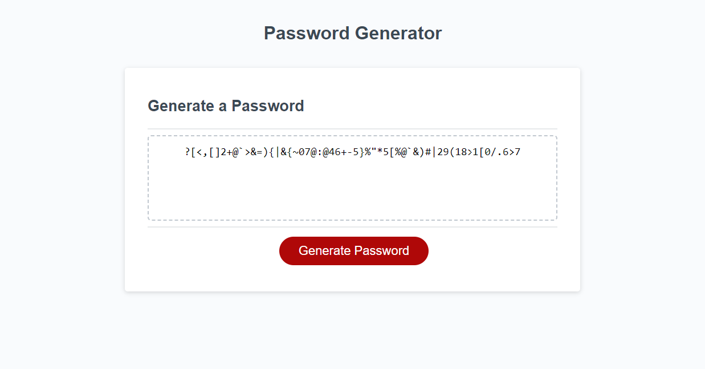

# password-generator

## About
This is a simple site that you can use to generate a password with the options to include lowercase letters, uppercase letter, special characters, and numbers with any length between 8 and 128 characters.
I built this project with the intent to learn basic javascript functions, using inputs given by a user to generate a random password.



## Visit the site!
[Vist!](https://mattjgatsby.github.io/password-generator/)
## Code Snippet

In this code snippet, you can see how I used the math.floor and math.random methods to generate a random number from a given array.

```` function generatePassword() {
  var passwordLocal=""
  var masterALocal= makeMasterA();
  function chooseChar() {
    var char = masterALocal[Math.floor(Math.random() * masterALocal.length)];
    return char;
  }
    for(var i = 0; i < passLength; i++) {
      passwordLocal = passwordLocal + chooseChar()
    }
    return passwordLocal;
}
````
## Author links
[Github](https://github.com/mattjgatsby)
[LinkedIn](https://www.linkedin.com/in/matthew-gatsby-1a1521250/)